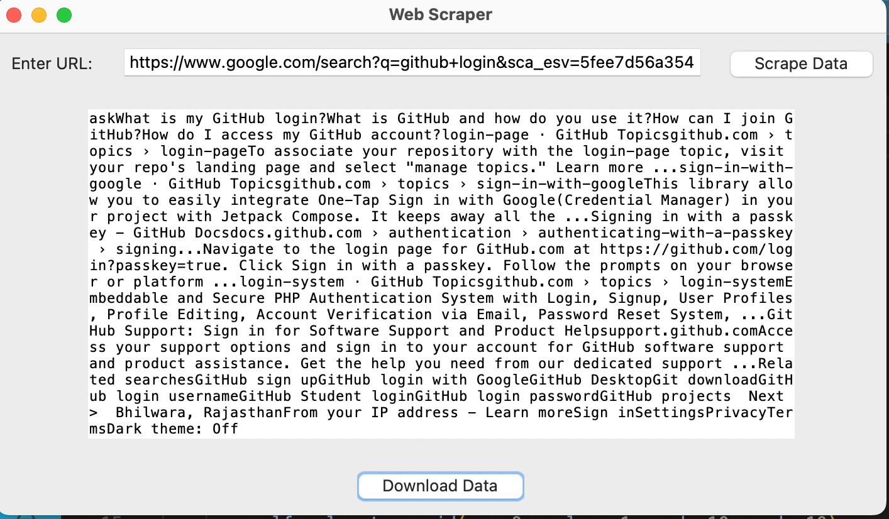

# Markdown to HTML Converter

## Introduction
This GUI application simplifies the process of web scraping by allowing users to input website URLs, select specific data elements to scrape, customize scraping parameters, and manage the extracted data effortlessly. Users can also download the scraped data in various formats.

## Usage
1. Install dependencies:
   ```bash
   pip install beatifulsoup4 requests
   ```

2. Run the scraper:
   ```bash
   python web_scraper.py
   ```

3. The downloaded data will be generated with the same name as the file name web_scraper.csv

## Example


To run scraper:
```bash
python web_scraper.py
```

The downloaded file `web_scrapery.csv` will be generated.

## Dependencies
Make sure you have the necessary libraries installed. You can install BeautifulSoup and requests using pip
  ```bash
pip install beatifulsoup4 reuests
```
## How it Works
This will execute the script and launch the web scraper GUI. You can input a URL, click the "Scrape Data" button to scrape the data, and then click the "Download Data" button to save the scraped data to a CSV file.

## Contribution
Contributions are welcome! Feel free to submit issues or pull requests.
